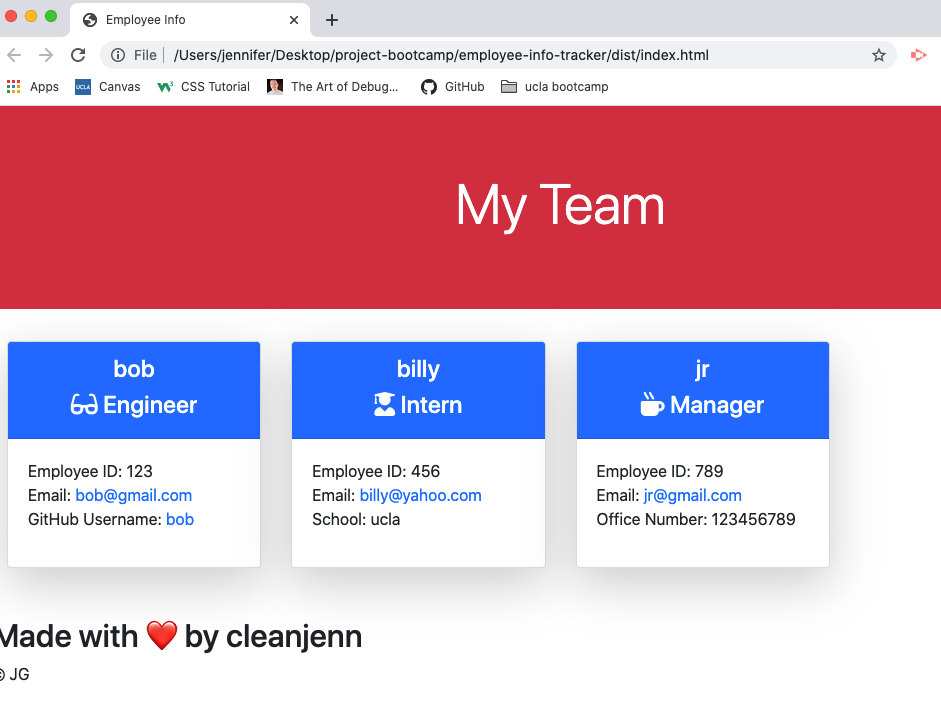

# employee-info-tracker

 https://cleanjenn.github.io/employee-info-tracker/

 # Mock Up

 

 # Table of Contents 

- [Mock Up](#mock-up)
- [Description](#description)
- [User Story](#user-story)
- [Acceptance Criteria](#acceptance-criteria)
- [Installation](#installation)
- [Usage](#usage)
- [Contributing](#contributing)
- [Questions](#questions)

# Description

I used a command-line application that takes in information about employees on a software engineering team. Then the application generates an HTML webpage that displays summaries for each person in place card.  The HTML file is then displayed in a separate file directory that is located [Here](./dist/index.html)

The full video showing functionallity of the appliction including the tests that were ran to collect the employees data can be accessed via this link:
[Video Link](https://drive.google.com/file/d/1bq9Aqgerrc4IOuYwPltblX3_6XzZd261/view?usp=sharing)

# User Story 
```
AS A manager
I WANT to generate a webpage that displays my team's basic info
SO THAT I have quick access to their emails and GitHub profiles
```
# Acceptance Criteria
```
GIVEN a command-line application that accepts user input
WHEN I am prompted for my team members and their information
THEN an HTML file is generated that displays a nicely formatted team roster based on user input
WHEN I click on an email address in the HTML
THEN my default email program opens and populates the TO field of the email with the address
WHEN I click on the GitHub username
THEN that GitHub profile opens in a new tab
WHEN I start the application
THEN I am prompted to enter the team manager’s name, employee ID, email address, and office number
WHEN I enter the team manager’s name, employee ID, email address, and office number
THEN I am presented with a menu with the option to add an engineer or an intern or to finish building my team
WHEN I select the engineer option
THEN I am prompted to enter the engineer’s name, ID, email, and GitHub username, and I am taken back to the menu
WHEN I select the intern option
THEN I am prompted to enter the intern’s name, ID, email, and school, and I am taken back to the menu
WHEN I decide to finish building my team
THEN I exit the application, and the HTML is generated
```

# Installations 
`node`<br />
`npm init` <br />
`npm install inquirer`<br />
`npm install joi`<br />
`npm install email-validator`

# Usage
```
Ability to generate an HTML page contaning multiple employees by answering questions prompt to the user directly from the comand line. 
```
# Contributions

[Jennifer](https://github.com/cleanjenn)

# Questions 

Feel free to contact me via email: <br /> [Email](mailto:jennifer23gomez7@gmail.com)<br /> 
[Github](https://github.com/cleanjenn)<br />
